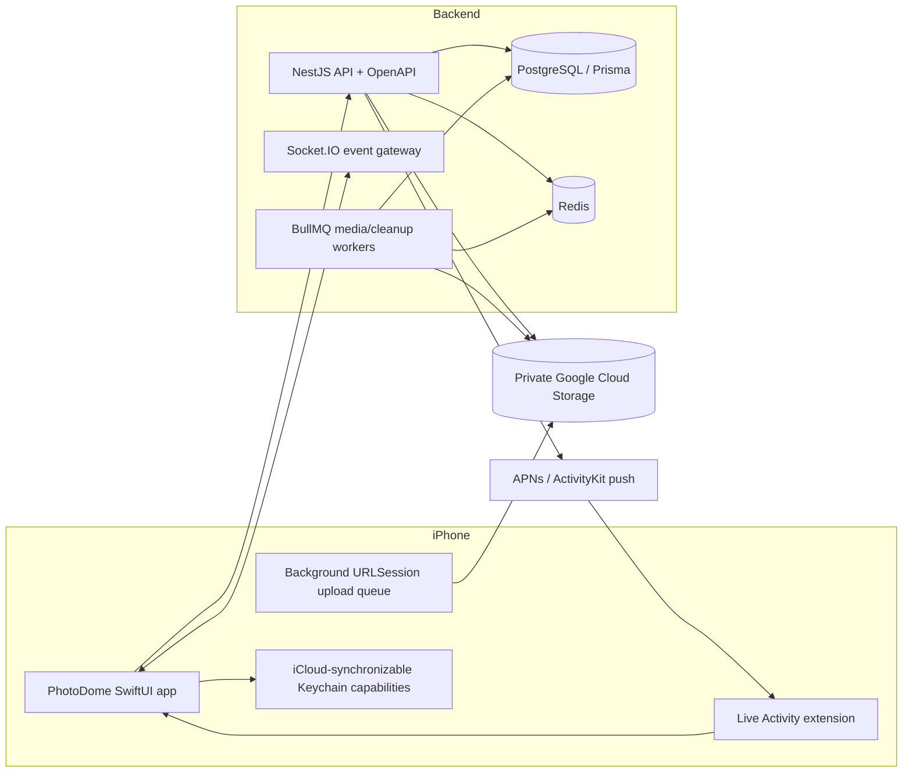

# Architecture and Implementation Plan v0

Build plan for the approved PhotoDome MVP: an iPhone-only, accountless event-photo app with a native Live Activity, NestJS backend, realtime shared album, durable direct GCS uploads, private swipe curation, and verified seven-day deletion. Product behavior is defined in [[Product Discovery Brief]]; the media subsystem is defined in [[Media Upload and Retention]].

Created 2026-07-25 when the founder approved the remaining privacy, moderation, gesture, image-quality, and scale defaults.

Amended 2026-07-26 by [[2026-07-26 Media Fidelity Decision]] for
full-resolution master preservation, embedded GPS/source metadata, required
foreground precise-location camera authorization, optimized browsing variants,
and removal of repeated lossy master encoding.

## Overview & Context

**The implementation outcome** — Deliver a TestFlight-ready vertical product where an anonymous host creates an event, guests join through QR/code, up to 100 attendees contribute up to 2,000 photos, the album updates live, every participant can save the current set or privately swipe-select without waiting for the host, the host ends/restricts the event, and media is permanently removed after expiry.

**Current state** — M0 through M6 and the local M7 hardening tranche are complete in this repository: the product flow, verified seven-day cleanup, security/scale envelope, production fail-closed configuration, dependency readiness, privacy manifest/copy, accessibility audits, approved app icon, and unsigned Release archive are in place. The real development GCS policy, private media lifecycle, and all-generation prefix deletion are verified in [[GCS Development Bucket Validation]] and [[M6 Expiry Security and Scale]]. [[2026-07-26 Media Fidelity Decision]] is implemented locally: compatible JPEG masters retain their encoded bytes and embedded GPS/source metadata, the backend never overwrites the master during variant generation, and PhotoDome camera capture requires foreground precise location and embeds the shutter-time coordinate. [[M7 Local Release Hardening]] records the local result; production deployment, Apple/App Store configuration, and physical-device validation remain active in [[M7 Release Checklist]].

**Build strategy** — Establish the complete data/security spine first, then grow one end-to-end path. Do not build isolated screens against fake models after the first scaffold; every milestone should leave a working host-create → guest-join → upload → shared-view path.

## Goals & Non-Goals

### Goals

1. Mirror foodapp's proven native iOS + NestJS/OpenAPI development model without importing unrelated product modules.
2. Make accountless capability security a foundational layer, not a UI shortcut around conventional accounts.
3. Send photo bytes directly between iPhone and private GCS, with the API controlling admission and completion.
4. Preserve uploads across backgrounding and host restriction.
5. Enforce the 100-attendee, 2,000-photo, and 20 MB-original v1 limits at reservation time.
6. Prove permanent expiry with destructive integration tests and bucket-configuration checks.
7. Keep every milestone testable locally and in an isolated development environment.

### Non-goals

- Android, web, or desktop clients.
- User profiles, follows, public discovery, comments, reactions, captions, video, AI curation, or facial recognition.
- Permanent hosted albums.
- Copying foodapp's public-bucket or API-proxied multipart upload behavior.
- Choosing production hosting or a business model in this plan.

## System at a Glance



## Repository Layout

Mirror foodapp's two-application separation inside the PhotoDome workspace:

```text
photodome/
├── AGENTS.md
├── README.md
├── photodome-api/
│   ├── src/
│   ├── prisma/
│   ├── test/
│   ├── docker-compose.yml
│   └── package.json
└── photodome-ios/
    ├── PhotoDome/
    ├── PhotoDomeLiveActivity/
    ├── PhotoDomeTests/
    ├── Scripts/
    └── PhotoDome.xcodeproj
```

Use one parent Git repository unless a later deployment constraint requires independent repositories. Generated build output, local credentials, resumable-session URIs, and uploaded test media stay untracked.

## Backend Architecture

### Baseline stack

- NestJS 11 and strict TypeScript.
- PostgreSQL with Prisma schema/migrations and UUID primary keys.
- Redis and BullMQ for media processing, delayed expiry, retry, and reconciliation.
- Socket.IO for foreground realtime event updates.
- Swagger/OpenAPI as the client contract.
- Pino structured logging with capability/session redaction.
- Jest unit tests and Supertest E2E tests.
- Local Docker Compose for PostgreSQL and Redis.

Pin exact compatible package versions during scaffolding, using the current foodapp API as the starting compatibility set rather than copying its full dependency list.

### Clean Architecture modules

Every module uses `domain`, `application`, `infrastructure`, and `presentation` layers.

| Module | Responsibility |
|---|---|
| `capabilities` | Hash/verify host and member bearer capabilities; installation binding; one-time host transfer. |
| `events` | Create/read event, lifecycle state, required name, host display name, deferred cover/location fields, end, upload restriction, code rotation. |
| `memberships` | Accountless join, member list/count, host removal, 100-member limit. |
| `photos` | Reservation, completion verification, photo state, moderation removal, 2,000-photo/20 MB limits. |
| `media` | GCS resumable sessions, signed reads, checksum/metadata verification, variants, prefix deletion. |
| `selections` | Private per-member keep/skip/undo state and download manifest. |
| `realtime` | Socket authorization/rooms and domain-event fan-out. |
| `live-activities` | ActivityKit push-token registration and event-state/count pushes. |
| `cleanup` | Delayed expiry, retries, reconciliation, metrics, and tombstones. |
| `health` | Liveness/readiness including PostgreSQL, Redis, and required bucket configuration. |

Domain code must not import NestJS, Prisma, GCS, Socket.IO, or APNs types.

## Data Model

This is the domain shape, not a full Prisma schema.

### `events`

| Field | Purpose |
|---|---|
| `id` | UUID and GCS prefix owner. |
| `name` | Required host-entered event name. |
| `host_display_name` | Creator name shown on event cards and session details. |
| `cover_photo_id` | Optional approved event photo. |
| `location_label` | Reserved optional display string; not collected or shown in 0.1.0. |
| `state` | `LIVE` · `ENDED` · `EXPIRING`. Expired events are deleted, not retained as product records. |
| `join_code_hash` | Hash of the current human-enterable code. |
| `uploads_restricted_at` | Null while new reservations are admitted. |
| `ended_at` | Immutable host-controlled live-end time. |
| `expires_at` | `ended_at + 7 days`. |
| timestamps | Creation/update for operations. |

### `event_members`

| Field | Purpose |
|---|---|
| `id` | Anonymous event-scoped member UUID. |
| `event_id` | Parent event. |
| `role` | `HOST` or `GUEST`. |
| `display_name` | Required 1–50 character in-session name supplied from the participant’s saved device profile. |
| `capability_hash` | Server-side hash; the raw bearer capability exists only on the iPhone. |
| `join_binding_hash` | Optional purpose-separated HMAC of the invite plus installation signal; unique within an event so scanner/transport retries resolve to one guest. It is cleared on removal and never authorizes event access. |
| `removed_at` | Immediate revocation marker. |
| `joined_at` | Ordering/analytics. |

No email, phone number, password, Apple identity, public profile, or cross-event social identity is required. The iPhone retains one device-local display name and supplies it when creating or joining; the server stores that name only with each event membership.

### `host_transfer_tokens`

Short-lived, one-time, server-hashed tokens with `event_id`, expiry, consumed time, and capability-rotation transaction.

### `photos`

| Field | Purpose |
|---|---|
| `id`, `event_id`, `contributor_member_id` | Ownership and authorization scope. |
| `state` | `RESERVED` · `UPLOADING` · `PROCESSING` · `READY` · `FAILED` · `REMOVED` · `EXPIRED`. |
| `original_key`, `display_key`, `thumb_key` | GCS paths retained until verified cleanup. |
| `content_type`, `byte_size`, `sha256` | Admission and completion integrity. |
| `width`, `height`, `captured_at`, `orientation` | Indexed display/download fields; the private master retains its additional embedded source metadata. |
| `reserved_at`, `ready_at`, `removed_at` | Lifecycle and moderation. |
| `admitted_before_restriction` | Explicit grandfathering proof. |

### `photo_selections`

Unique `(member_id, photo_id)` record with `decision: KEEP | SKIP`, sequence number, and timestamps. Private to that member. Undo removes/reverts the latest sequence item; it never changes the shared photo.

### `cleanup_tombstones`

Retains event ID, GCS prefix, expiry, attempt count, last error, next retry, and cleanup metrics until GCS is verified empty and database deletion completes.

## Event State and Authorization

### Lifecycle

```text
LIVE
  take-home available for each member
  host ends
    -> ENDED (uploads still open by default; take-home remains available)
       host restricts -> uploads_restricted_at set
       expires_at reached -> EXPIRING
         GCS verified empty + DB purge -> record removed
```

- `ENDED` is not read-only.
- Host restriction blocks new reservations only.
- Reservations committed before the cutoff may finish/retry until `expires_at`.
- At `expires_at`, access and completion publication stop regardless of reservation age.

### Capability types

| Capability | Can do |
|---|---|
| Join code/QR | Admit a new anonymous guest while valid and under capacity. |
| Guest capability | Read event/photos, reserve uploads, finish admitted uploads, delete own contributed photos, and manage own selection/download. |
| Host capability | Guest actions plus end event, restrict uploads, remove members, rotate join code, and initiate transfer. It cannot delete another member's photo. |
| Transfer token | One-time exchange for a rotated host capability; no other event access. |

Use high-entropy opaque bearer capabilities, store hashes server-side, compare in constant time, redact from logs, and rotate host authority atomically on transfer. The human join code is rate-limited and never authorizes host actions.

## API Contract

All routes live under `/v1`. Names are the planned OpenAPI operations; exact DTO spelling may change during implementation without changing behavior.

| Method | Path | Operation | Authorization |
|---|---|---|---|
| `POST` | `/events` | `createEvent` | Event name plus device display name; returns host capability once. |
| `POST` | `/events/join` | `joinEvent` | Valid join code plus device display name and installation header; idempotent retries return the same guest capability. |
| `GET` | `/events/:eventId` | `getEvent` | Event capability. |
| `PATCH` | `/events/:eventId/members/me` | `updateOwnEventDisplayName` | Event capability belonging to the member being renamed. |
| `GET` | `/events/:eventId/photos` | `listEventPhotos` | Event capability; cursor pagination. |
| `POST` | `/events/:eventId/end` | `endEvent` | Host capability; idempotent. |
| `POST` | `/events/:eventId/restrict-uploads` | `restrictEventUploads` | Host capability; idempotent cutoff. |
| `POST` | `/events/:eventId/rotate-code` | `rotateEventJoinCode` | Host capability. |
| `DELETE` | `/events/:eventId/members/:memberId` | `removeEventMember` | Host capability. |
| `POST` | `/events/:eventId/host-transfer` | `createHostTransfer` | Host capability. |
| `POST` | `/host-transfers/exchange` | `exchangeHostTransfer` | One-time token. |
| `POST` | `/events/:eventId/photos/reservations` | `reservePhotoUpload` | Event capability; admission transaction. |
| `POST` | `/events/:eventId/photos/:photoId/complete` | `completePhotoUpload` | Capability owning an admitted reservation. |
| `DELETE` | `/events/:eventId/photos/:photoId` | `removeEventPhoto` | Capability belonging to the photo contributor. |
| `PUT` | `/events/:eventId/selections/:photoId` | `setPhotoSelection` | Member capability; private. |
| `DELETE` | `/events/:eventId/selections/latest` | `undoLatestSelection` | Member capability. |
| `GET` | `/events/:eventId/download-manifest` | `getDownloadManifest` | Member capability; all or kept set, signed original URLs. |
| `POST` | `/events/:eventId/live-activity-token` | `registerEventLiveActivityToken` | Member capability. |

### Upload-admission transaction

`reservePhotoUpload` must atomically:

1. Verify event/member capability and member not removed.
2. Reject `EXPIRING`/expired events.
3. Reject new reservations after `uploads_restricted_at`.
4. Enforce 100-member/2,000-photo limits and declared file size ≤20 MB.
5. Create the `RESERVED` photo with deterministic event/photo GCS keys.
6. Initiate/return a GCS resumable session.

An already-created reservation remains valid after upload restriction. Retries address that reservation; they do not create a new one.

## GCS and Image Processing

Follow [[Media Upload and Retention]] exactly:

- Separate private dev/staging/prod buckets.
- Uniform bucket-level access and enforced Public Access Prevention.
- No public IAM, soft delete, Object Versioning, retention hold, or blocking bucket retention policy.
- Event/photo-prefixed original, display, and thumbnail keys.
- Direct resumable upload from a background iOS file task.
- Completion verifies object existence, declared size, content type, and checksum.
- BullMQ/Sharp produces 2048 px display and 512 px thumbnail JPEGs.
- Keep a full-resolution master; preserve capture time, orientation, GPS, and other embedded source metadata. Preserve the encoded source where supported or normalize once at high quality, and never re-encode/overwrite the master during variant processing.
- Require foreground precise-location authorization for PhotoDome camera capture and embed the coordinate captured with the shutter. Preserve a library import's own GPS; never stamp it with import-time location.
- Signed reads expire quickly and are never stored as durable database values.
- Contributor photo deletion hides the photo immediately, then uses a retryable tombstone to delete and verify that photo's original/variants before discarding its keys.
- Expiry deletes and verifies the complete event prefix before database media keys disappear.

## Realtime and Live Activity

### Socket.IO

- Authenticate socket connection with the event-scoped capability.
- Join one room per event/member authorization.
- Emit only after the database transaction or worker state is committed.

| Event | Payload purpose |
|---|---|
| `event.member_joined` | Update participant count. |
| `event.member_removed` | Revoke/dismiss the removed client. |
| `event.photo_ready` | Add a fully processed photo to the album. |
| `event.photo_removed` | Remove it from connected albums and selections. |
| `event.ended` | Move clients to wrap-up while keeping upload UI if unrestricted. |
| `event.uploads_restricted` | Disable new selection/capture; leave admitted progress running. |
| `event.code_rotated` | Refresh host invite UI without exposing the code to guests. |
| `event.expired` | Purge local event cache and close the experience. |

Reconnect always performs a REST snapshot before applying new socket events. Socket delivery is an acceleration, not the source of truth.

### ActivityKit/APNs

- Live Activity exists only during `LIVE`.
- Show event name, ready-photo count, and a capture affordance.
- The visible Live Activity surface and its camera affordance both deep-link directly to the event camera; album access remains available inside the app.
- Own-device changes update locally; server changes use ActivityKit push when a valid token exists.
- Host end terminates the Live Activity for all participants and opens the in-app wrap-up.
- The core app works if Live Activities are disabled.

## iOS Architecture

### Targets

- `PhotoDome` application.
- `PhotoDomeLiveActivity` widget extension.
- `PhotoDomeTests`.

### Foundation/services

| Component | Responsibility |
|---|---|
| `CapabilityStore` | Synchronizable Keychain storage, redaction, rotation, transfer exchange. |
| `DeviceProfile` | Device-only Keychain storage for the first-launch display name; no account or login. |
| `APIClient` | Generated OpenAPI client plus capability header middleware. |
| `EventSocketClient` | Authenticated Socket.IO room, reconnect snapshot, event stream. |
| `BackgroundUploadManager` | Persistent reservation/session/file state and background `URLSession` callbacks. |
| `CaptureLocationProvider` | Centralized foreground precise-location authorization/status, shutter-time coordinate capture, and Settings recovery. |
| `ImagePreprocessor` | Source inspection and 20 MB validation; retain embedded metadata and encoded source pixels where supported, otherwise perform one high-quality full-resolution normalization. |
| `PhotoLibraryWriter` | Add-only permission and source-quality save-all/selected writes. |
| `EventLiveActivityManager` | Request/update/end and deep-link routing. |
| `EventCache` | Event/photo snapshot and signed-URL-aware image cache expiry. |

### Feature groups

```text
Features/
├── Home/
├── CreateEvent/
├── JoinEvent/
├── EventAlbum/
├── Capture/
├── HostControls/
├── SwipeReview/
└── Download/
```

Use SwiftUI observation and structured concurrency. Keep network/storage DTOs out of feature views; map generated types into app models at repository boundaries.

The event camera uses an app-owned `AVCaptureSession` and
`AVCapturePhotoOutput` surface. One shutter press captures without an
intermediate review confirmation, saves the source capture to Photos, queues
the full-resolution event upload with its shutter-time GPS coordinate, and
dismisses back to the event. Camera setup and capture run off the main thread.
Foreground precise-location authorization is required; denied, restricted, or
reduced-accuracy location blocks capture and exposes a Settings recovery path.
Unavailable camera hardware and capture failure retain an explicit PhotoKit
fallback or retry path. Importing a library photo preserves its own metadata and
never attaches the device's location at import time.

### QR and deep links

- QR contains an HTTPS universal link carrying the public join code.
- Manual short code is always visible as fallback.
- If the app is installed, universal link opens Join Event.
- App Store/install handoff behavior needs device validation; never place a host capability in a universal link intended for guests.
- Host-transfer QR uses a distinct route and single-use short expiry.

## Curation and Download

- Private review, Keep/Skip/Undo, `ALL` manifests, and `KEPT` manifests are available to every authorized member during `LIVE` and unexpired `ENDED` states.
- The iPhone labels live bulk saving **Save current photos** and ended bulk saving **Save all**; both lifecycle states expose **Choose photos** once a ready photo exists.
- The swipe deck uses thumbnail/display assets, prefetches a small bounded window, and persists each decision privately.
- Right = Keep; left = Skip; Undo reverts the most recent decision.
- Photos arriving during review enter a clearly identified remaining queue without resetting prior decisions.
- Removed photos disappear from the deck and any not-yet-started download.
- Save all and Save selected request a paginated signed-original manifest.
- Download originals with a bounded concurrent background queue; report progress and per-item retry.
- Add to Photos with add-only permission. Permission denial preserves the manifest/selection until expiry.
- A completed device save is outside server deletion; server originals still expire at day seven.

## Error, Offline, and Race Behavior

| Condition | Required behavior |
|---|---|
| Invalid/rotated code | Explain that the invite is no longer valid; do not reveal whether a private event exists beyond that. |
| Member removed | Revoke socket and REST access; clear signed URLs and local event cache. |
| Host restricts during reservation request | Database transaction determines winner: committed reservation continues; later request rejects. |
| App backgrounds/terminates during upload | OS-backed file upload persists; app restores progress/completion from stored reservation. |
| Upload completes after event expiry | Do not publish; delete the object and let reconciliation verify the prefix. |
| Socket disconnects | Show last snapshot, reconnect, refresh REST snapshot, then resume events. |
| Photos permission limited | Use system-selected assets and explain how to add access. |
| Location denied/restricted/reduced accuracy | Keep PhotoDome camera capture unavailable, explain that precise location is required for shared photo metadata, and route to iOS Settings. |
| GCS processing fails | Photo stays retryable/non-visible; never announce a broken asset. |
| Partial bulk download | Keep successes, list failures, allow retry until expiry. |
| Cleanup failure | Event remains inaccessible; tombstone and keys remain; retry and alert. |

## Security, Privacy, and Cost Controls

- Private-by-capability event access; no public object URLs or public event feed.
- Hash capabilities and join codes server-side; rate-limit code attempts by IP/install/event.
- Redact capabilities, resumable-session URIs, signed URLs, extracted EXIF values, and media bytes from logs/traces.
- Enforce content type, magic-byte sniffing, dimensions, size, checksum, and decompression safety.
- Retain GPS and other embedded source metadata only inside the private master; do not copy it into logs, traces, analytics, or public metadata responses. Never expose storage keys as authorization.
- Disclose before contribution that authorized event members may download precise location and other embedded metadata. Reconcile the final behavior with App Store privacy answers before release.
- Request foreground/When-In-Use location only; background or Always location is not required by the approved capture flow.
- Signed URLs are short-lived and event/member authorized at issuance.
- Bucket startup/predeploy validation fails on public IAM, versioning, soft delete, or deletion-blocking policies.
- Monitor live bytes, derived/original ratio, egress, failed reservations, cleanup lag, and unexpected noncurrent/soft-deleted bytes.
- Never reuse `foodapp-dev`.

## Observability

### Metrics

- Create/join success and latency.
- Active members and ready photos per event.
- Reservation/upload/processing latency and failure rate.
- Socket connected/reconnect rate.
- Signed-download bytes and completion rate.
- Host restriction race outcomes.
- Cleanup objects/bytes removed, attempts, age past expiry, and verification failures.
- Bucket noncurrent/soft-deleted bytes—expected zero.

### Structured log fields

Use event/photo/member IDs, operation, state transition, duration, byte count, and retry number. Never log raw capabilities, join codes, session URIs, signed URLs, filenames containing user text, or image metadata.

## Testing Strategy

### Backend unit tests

- Capability hashing, role authorization, transfer rotation, and revoked-code behavior.
- Event state transitions and immutable `endedAt`/`expiresAt`.
- Reservation grandfathering at the restriction race.
- 100/2,000/20 MB boundary conditions.
- Private selections and Undo ordering.
- Cleanup idempotency and failure recovery.

### Backend E2E tests

- Anonymous create → QR/code join → reserve → complete → list.
- Contributor-owned photo deletion, host member removal, and host code rotation.
- End → continued upload → restrict → admitted upload completes/new upload rejects.
- Expire → access rejects → all GCS prefix objects deleted → DB purge.
- Bucket-policy validator rejects unsafe fixtures.

Use a disposable GCS test bucket or emulator-compatible storage adapter; the destructive real-GCS cleanup test must target an isolated prefix/bucket and verify all generations.

### iOS tests

- Capability Keychain round trip and rotation.
- Universal/deep-link routing.
- Upload queue restoration and background callback mapping.
- Active upload-pipeline states collapsing into one **Uploading** presentation,
  plus square center-crop geometry for portrait/landscape optimistic tiles.
- Foreground precise-location allow/deny/restricted/reduced-accuracy state, Settings recovery, shutter-time coordinate embedding, and no import-time coordinate substitution.
- Socket reconnect snapshot.
- Swipe keep/skip/Undo and private state.
- Bulk save progress, permission denial, and partial retry.
- First-launch display-name gating, device persistence, create/join propagation, host attribution, and named attendee lists.
- Settings display-name editing, existing-membership propagation, and realtime member-name refresh.
- Live Activity state/deep-link behavior.

### Multi-device verification

At least two real iPhones are required for camera, PhotoKit, Keychain sync, Socket.IO pooling, ActivityKit/APNs, host removal, transfer QR, post-end upload, restriction races, and seven-day cleanup rehearsal with a shortened test TTL.

## Milestones

### M0 — Scaffold and local foundation

- Create NestJS and Xcode projects, widget extension, tests, lint/format, Docker Compose, environment validation, and OpenAPI generation script.
- Exit: API health and blank iOS app build clean; generated client calls local API.
- Status: complete 2026-07-25. The generated Swift client successfully called the live local health API from the iPhone simulator.

### M1 — Accountless event spine

- Capability guard/store, event/member schema, create, QR/code join, event snapshot, Keychain recovery, code rotation, transfer QR.
- Exit: two devices create/join privately with no account.
- Status: complete locally 2026-07-25. Backend E2E tests and an iOS integration test using two independent installation identities prove create/join, rotation, retained guest access, one-time transfer, and old-host revocation. Physical-device QR scanning and iCloud Keychain synchronization still require device validation before TestFlight.

### M2 — Direct upload and live album

- Reservation transaction, direct GCS resumable upload, background queue, completion verification, variants, signed reads, Socket.IO ready event.
- Exit: guest photo appears on host device; background/retry works.
- Status: complete locally 2026-07-25, amended 2026-07-26. Backend E2E and the generated Swift integration client prove a guest direct upload becomes a processed host-visible album photo; the persistent iOS background queue, restoration, progress, and session-renewal retry path are implemented. The amended pipeline preserves compatible JPEG masters byte-for-byte with embedded metadata and produces separate metadata-free Sharp variants without overwriting the master. Physical-iPhone termination/relaunch, weak-network, expired-session retry, full Photos round-trip, and production-GCS validation remain release gates.

### M3 — Capture and Live Activity

- Camera, multi-select PhotoKit import, progress UI, Live Activity, APNs updates, capture deep link.
- Exit: ≤2 interactions from Lock Screen to event camera; denied Live Activity does not block the app.
- Status: complete locally, refined 2026-07-26. The large monochrome Lock Screen activity makes the live event, READY-photo count, camera cue, and full-width capture action immediately legible without inventing progress; its visible live surfaces open a repeatable capability-free capture route, while a transient ended state opens the album. Serialized cold-start restoration resolves local event access before navigation; one app-owned AVFoundation shutter requires a fresh foreground precise coordinate, embeds shutter-time GPS and capture date, saves the prepared master locally, and queues the durable M2 upload without a confirmation screen. Denied, restricted, and reduced-accuracy states route to Settings; no background/Always location is requested. Rotating activity tokens register through the generated client, and each READY photo produces an authoritative-count APNs update when credentials are configured. Simulator unit/accessibility suites and unsigned device Release compilation pass. Physical-iPhone location/camera allow-deny recovery, metadata inspection, Lock Screen interaction timing and visual fit, flash, signed provisioning, and real sandbox APNs delivery remain release gates. See [[M3 Camera and Live Activity]].

### M4 — Host lifecycle and moderation

- End, post-end uploads, restriction cutoff, grandfathered transfers, contributor photo deletion, host member removal, and code-rotation propagation.
- Exit: concurrency tests prove no admitted upload is cancelled and no new post-cutoff reservation succeeds.
- Status: complete locally 2026-07-25. Serializable lifecycle/reservation ordering, idempotent seven-day timestamps, post-end open admission, grandfathered renewal, attendee revocation, retryable verified GCS photo deletion, realtime propagation, iOS host controls, and local/remote ActivityKit termination are implemented. Backend concurrency/E2E and live generated-client integration suites pass. Two-iPhone revocation, background transfer, and real sandbox APNs end delivery remain release gates. See [[M4 Host Lifecycle and Moderation]].

### M5 — Personal curation and download

- Save all, swipe right/left, Undo, private persistence, incoming/removed photo handling, signed-original download queue, Photos save.
- Exit: two attendees produce different private saved sets without changing the shared album.
- Status: complete locally 2026-07-25, amended 2026-07-26 and 2026-07-28. Member-scoped KEEP/SKIP persistence, Undo, paginated pending review, realtime incoming/removal handling, live and ended `ALL`/`KEPT` signed-master manifests for every participant, a protected three-wide iOS background download queue, add-only Photos saving, and per-item retry are implemented. The live iPhone surface exposes **Choose photos** and **Save current photos** as soon as a ready contribution exists, then uses **Save all** after ending. Backend E2E proves live guest review and bulk saving plus distinct private sets without changing the shared album; the media E2E test proves the downloadable master remains byte-for-byte identical through variant processing. Physical-iPhone Photos permission, background interruption, metadata inspection, and multi-device realtime validation remain release gates. See [[M5 Personal Curation and Download]].

### M6 — Expiry, security, and scale

- Delayed cleanup, reconciliation, metrics, bucket-policy validation, security review, 100-member/2,000-photo load test.
- Exit: shortened-TTL test proves GCS prefix empty across all generations and DB metadata purged.
- Status: complete locally 2026-07-25. Deterministic delayed cleanup, independent tombstones, retry/reconciliation, orphan-prefix discovery, protected Prometheus metrics, fail-closed bucket fixtures, Pino secret-redaction proof, and the 100-member/2,000-photo scale gate are implemented. The shortened-TTL E2E test proves access revocation, all-generation prefix deletion, and complete metadata purge; the real development bucket independently reports zero generations after isolated prefix cleanup. Production infrastructure, external alerting, and physical-device rehearsal remain M7/release gates. See [[M6 Expiry Security and Scale]].

### M7 — Release hardening

- Accessibility, localization decision, privacy copy, analytics consent, crash/observability setup, TestFlight configuration, real-device regression.
- Exit: release checklist green and reference/as-built docs created.
- Status: in progress 2026-07-26. Local production guards, readiness, response headers, privacy manifest/copy, Base-English extraction, four accessibility audits, generated-client regression, approved app icon, and an unsigned production-shaped archive are complete. The first beta is version `0.1.0` build `1`. The exit is not met: signing, production infrastructure/observability, App Store metadata, language and crash-provider decisions, and the two-iPhone matrix remain. See [[M7 Release Checklist]] and [[M7 Local Release Hardening]].

## Acceptance and Release Gates

The MVP is build-complete only when:

- Every approved acceptance criterion in [[Product Discovery Brief]] has an automated or named device test.
- No event action requires account registration.
- A 100-member/2,000-photo synthetic event stays within agreed latency/error budgets established during M6.
- Host restriction race tests pass consistently.
- Full-resolution downloads preserve capture date, orientation, GPS, and other embedded source metadata for supported still photos, without repeated lossy master encoding.
- PhotoDome camera capture requires foreground precise location, embeds the shutter-time coordinate, and does not request background/Always location.
- Live Activity is optional and terminates on host end.
- A destructive expiry test verifies zero GCS objects/generations and zero retained event metadata.
- Bucket validation proves no public IAM, soft delete, versioning, or blocking retention.
- No capability/session/signed URL appears in logs.
- The vault receives shipped reference docs before release is described as shipped.

## Alternatives Considered

| Option | Benefit | Cost / reason rejected |
|---|---|---|
| Conventional user accounts | Familiar authorization/recovery | Violates the approved no-account experience. |
| Firebase-only backend | Fast realtime prototype | Diverges from the approved NestJS/PostgreSQL/foodapp operating model and cleanup control. |
| API-proxied photo multipart | Simple first endpoint | API becomes the bandwidth/memory bottleneck and background reliability is weaker. |
| Poll-only live album | Less realtime infrastructure | Poor event immediacy; Socket.IO is already in the approved stack. |
| GCS lifecycle as sole cleanup | Low application code | Asynchronous and does not prove per-event deletion; cannot replace verified cleanup/reconciliation. |
| Store optimized image only | Lower storage cost | Conflicts with approved source-quality downloads. |

## Non-Blocking Open Questions

- Business model and initial launch audience.
- Production API/PostgreSQL/Redis hosting provider and region.
- Supported languages for the first TestFlight release.

## Related

- [[Product Discovery Brief]]
- [[PhotoDome Design System]]
- [[PhotoDome Design System Reference]]
- [[Media Upload and Retention]]
- [[2026-07-25 Product Walkthrough]]
- [[2026-07-28 Live Take-Home Availability Decision]]
- the foodapp "Meal Lifecycle PRD" (external note, not included in this repo)
- the foodapp "Food Journal Photo Upload Stack" reference (external note, not included in this repo)
- [[Design Spec Rules]]
- [[M0 Development Foundation]]
- [[M1 Accountless Event Spine]]
- [[M2 Direct Upload and Live Album]]
- [[M3 Camera and Live Activity]]
- [[M4 Host Lifecycle and Moderation]]
- [[M5 Personal Curation and Download]]
- [[Release Versioning]]
- [[GCS Development Bucket Validation]]
